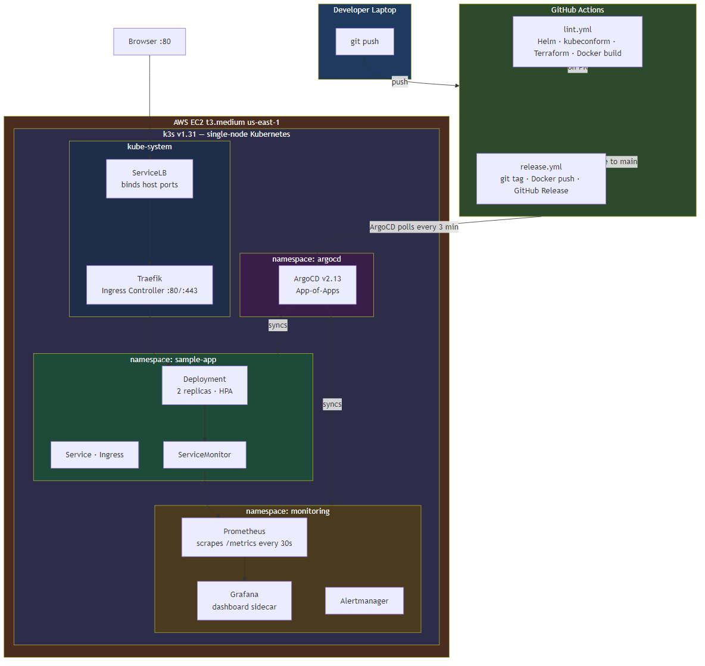

# k8s-platform-lab

> Self-hosted Kubernetes platform on AWS EC2 — k3s, ArgoCD GitOps, Prometheus + Grafana observability, Node.js sample app, Terraform-provisioned infrastructure.


---

## What this is

A fully self-hosted Kubernetes platform built to demonstrate real platform engineering skills:

- **Kubernetes** — k3s on a single AWS EC2 instance (`t3.medium`, `us-east-1`)
- **GitOps** — ArgoCD App-of-Apps pattern; push to `main` = deploy to cluster
- **Observability** — Prometheus + Grafana via `kube-prometheus-stack`; custom dashboard for the sample app
- **Sample app** — Node.js/Express with `/health` and `/metrics` endpoints, deployed via ArgoCD
- **Infrastructure as code** — Terraform provisions the VM, VPC, and firewall
- **CI/CD** — GitHub Actions: lint on PR, tag + Docker push on merge to `main`

---

## Architecture

```
GitHub repo (main)
      │  push
      ▼
 GitHub Actions
  ├── lint.yml     → helm lint, kubectl dry-run, terraform validate
  └── release.yml  → git tag, docker build+push, GitHub release
      │
      ▼
   ArgoCD (App-of-Apps)
      ├── sample-app         → apps/sample-app/k8s/
      ├── prometheus         → kube-prometheus-stack + observability/prometheus/values.yaml
      └── grafana-dashboards → observability/grafana/dashboards/ (Kustomize → Grafana sidecar)
      │
      ▼
  k3s cluster (AWS EC2 t3.medium, us-east-1)
      ├── namespace: sample-app   → Node.js app (2 replicas, HPA, Traefik ingress)
      ├── namespace: monitoring   → Prometheus + Grafana
      └── namespace: argocd       → ArgoCD
```



Full architecture with component rationale: [`docs/architecture.md`](./docs/architecture.md)

Key technical decisions and trade-offs: [`docs/decisions.md`](./docs/decisions.md)

---

## Prerequisites

| Tool | Version | Purpose |
|------|---------|---------|
| [Terraform](https://terraform.io) | >= 1.5 | Provision AWS infrastructure |
| [AWS CLI](https://aws.amazon.com/cli/) | >= 2.x | AWS credentials + API access |
| [kubectl](https://kubernetes.io/docs/tasks/tools/) | >= 1.28 | Cluster management |
| [Helm](https://helm.sh) | >= 3.x | Chart linting in CI |
| [ArgoCD CLI](https://argo-cd.readthedocs.io/en/stable/cli_installation/) | >= 2.x | Bootstrap root app |
| [gh CLI](https://cli.github.com/) | >= 2.x | Set GitHub Actions secrets |
| [Docker](https://docs.docker.com/get-docker/) | >= 24.x | Build sample app image |
| SSH key pair | ed25519 | VM access — generated by setup script |

---

## Quick start

> Full build narrative and decisions: [`docs/runbook.md`](./docs/runbook.md)

```bash
# 1. Clone
git clone https://github.com/traliach/k8s-platform-lab.git
cd k8s-platform-lab

# 2. Run prerequisites script (generates SSH key, sets GitHub secrets)
bash scripts/setup-prerequisites.sh

# 3. Provision the VM
cd infra && terraform init && terraform apply

# 4. Bootstrap the cluster via EC2 Instance Connect (AWS console → Connect)
#    In the browser shell on the VM:
sudo dnf install -y git
export PATH="/usr/local/bin:$PATH"
git clone https://github.com/traliach/k8s-platform-lab.git
cd k8s-platform-lab
bash cluster/bootstrap/install-k3s.sh
bash cluster/bootstrap/install-argocd.sh

# 5. Apply namespaces and bootstrap ArgoCD app-of-apps
kubectl apply -f cluster/namespaces.yaml
kubectl apply -f gitops/argocd/app-of-apps.yaml
```

---

## Repository structure

```
k8s-platform-lab/
├── .github/
│   └── workflows/
│       ├── lint.yml          # helm lint + kubectl dry-run + terraform validate
│       └── release.yml       # git tag + Docker image push + GitHub release
├── infra/                    # Terraform — AWS EC2, VPC, security group, key pair
├── cluster/
│   ├── bootstrap/
│   │   ├── install-k3s.sh    # idempotent k3s install
│   │   └── install-argocd.sh # ArgoCD install + initial config
│   └── namespaces.yaml       # argocd, monitoring, sample-app
├── apps/
│   └── sample-app/           # Node.js + Express (/, /health, /metrics) + Vite frontend
│       ├── server/index.js
│       ├── client/src/GrowStrongMealPlan.jsx
│       ├── Dockerfile
│       └── k8s/              # Deployment, Service, Ingress, HPA, ServiceMonitor
├── gitops/
│   └── argocd/
│       ├── app-of-apps.yaml  # root ArgoCD Application
│       └── apps/             # sample-app, prometheus, grafana manifests
├── observability/
│   ├── prometheus/values.yaml
│   └── grafana/dashboards/   # Kustomize ConfigMap + sample-app.json dashboard
├── scripts/
│   └── setup-prerequisites.sh
├── docs/
│   ├── architecture.md       # System diagram, components, design rationale
│   └── decisions.md          # Architecture Decision Records (ADR-001 – ADR-006)
└── PROJECT_PLAN.md
```

---

## Deployment

All deployments go through ArgoCD — never `kubectl apply` directly.

1. Push to a branch → PR → `lint.yml` runs
2. Merge to `main` → `release.yml` tags + pushes Docker image → ArgoCD auto-syncs

---

## Security

See [`SECURITY.md`](./SECURITY.md). Key rules:
- No secrets committed — all credentials via GitHub Actions secrets
- Non-root Docker image, pinned tags only
- Firewall allows only ports 22, 80, 443, 6443
- Grafana not on default credentials

---

## Contributing

See [`CONTRIBUTING.md`](./CONTRIBUTING.md).

---

## License

[MIT](./LICENSE) © 2026 Achille Traore | [achille.tech](https://achille.tech)
